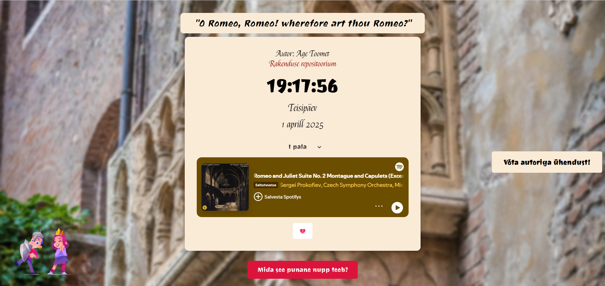

# 1-kodutoo

### Lehe autor on Age Toomet

## Ekraanipilt lehest


## Funktsionaalsus
* Klõpsates kella numbritele, saab muuta selle värvust - tuleb juhuslik värv.
* Vajutades üleval servas Romeo ja Julia näidendi tsitaadile, vahetub see uue tsitaadi vastu - kokku on 5 tsitaati.
* Kasutajal on võimalik valida kolme erineva taustamuusika vahel valides pala ning vajutades play nupule. Taustaks saab panna Sergei Prokofjevi "Romeo ja Julia" balletist valitud palasid.
* Kui vajutada nupule, millel on 💔 emotikon, lähevad lehe all vasakus servas olevad pildid horisontaalseks ehk tegelased n-ö kukuvad pikali. See funktsioon demonstreerib Romeo ja Julia näidendis peategelaste hukkumist.
* Vajutades nupule "Mida see punane nupp teeb?" hakkab lehe ülemisest servast langema roosiõisi. 
* Veebilehel on nupp "Võta ühendust!", mis jookseb hiire kursori eest ära ning kasutaja saab seda taga ajada, kuid seda päriselt vajutada ei saa, kuna selle kättesaamine on pea võimatu.

# 1-kodutoo

## Tähtaeg 01.04.2025 23:59

Max 15 punkti.

Kujunda elektroonilise kella näide kasutades chatGPT-d(https://chat.openai.com/chat) vastavalt maitsele või kindlale teemale, mahutades kella täisekraanile, et saaks kasutada lauakella või ekraanisäästja asemel. Selleks, et see sobiks paljudele ekraanidele, kasuta kujunduse loomisel protsendilisi väärtusi (nt width: 100%; ) või nt võimalda kella suurust kasutajal muuta.


## Nõuded

1. Veebirakendus töötab. Näitab kella, kuupäeva, nädalapäeva ja aastat.
1. Vastavalt kasutaja tegevusele on võimalik muuta **kuut** lauakella atribuuti muuta.
1. Kasutatud on eventListener'e ja funktsioone.
1. Kell on originaalne ning kasutajaliides on maitsekalt kujundatud kasutades CSS-i. 
1. Autori ees- ja perenimi on lehel välja toodud
1. Lehel on viide rakenduse repositooriumile
1. `README.md` failis on välja toodud autori nimi, ekraanipilt rakendusest ja kirjeldatud funktsionaalsus
1. Viidata kogu koodis promptidele, millega kood saadi. 

## Mõned ideed võimalikeks täiendusteks (lihtsalt, et mõte hakkaks jooksma)

* Vahetuda võivad taustapildid, taustal võib mängida muusika
* Taustale klikkides muudetakse kella taustaväri
* Kellale klõpsides muudetakse numbrite värvi või numbrite suurust;
* Iga numbri suurust saab eraldi muuta
* Nooleklahvidega saab kella ekraanil liigutada
* Küsi enne kella näitamise alustamist kasutajalt tema lemmikvärv ja tee sellest lähtudes midagi
* Muuda kella ja tausta värvi vastavalt ajale (päev/öö)
* Kella suurus ja asukoht sõltuvad hiire asukohast ekraanil
* Kirjatüüpi saab ka muuta, [google.com/fonts](https://www.google.com/fonts)
* Kasutaja saab lisada või kasutajaöe näidatakse mitu kellaaega erinevatest maailma kohtadest
* Elemendid muudavad asukohta teatud kasutaja käitumise peale.
* Saab vahetada keelt, kellaformaati vms.


### GitHub'i töövoog kodutöö esitamiseks

1. *Fork*'i ülesande/projekti repositoorium (leiab [https://github.com/eesrakendused-2025/](https://github.com/eesrakendused-2025/)).
1. *Clone*'i see repositoorium enda arvutisse/serverisse ja määra repositooriumi URL kuhu edaspidi muudatusi salvestad.
  ```
  git clone https://YOURUSERNAME@github.com/YOURUSERNAME/REPOSITORY.git

  nt esimese iseseisva töö puhul:
  git clone https://jukujuurikas@github.com/jukujuurikas/1kodutoo.git
  ```
1. Lisa vajdusel oma nimi ja email repositooriumi omanikuks ([Setting your username](https://help.github.com/articles/setting-your-username-in-git/)). Vajadusel hangi endale privaatne e-post @users.noreply.github.com lõpuga (https://github.com/settings/emails)
  ```
  git config --global user.name "Tauri Kirsipuu"
  git config --global user.email taurikirsipuu@users.noreply.github.com
  ```
1. Muuda faile ülesande lahendamiseks ja *Commit*'i iga olulisem muudatus, kasutades kahte käsku.
  ```
  git add .
  ```
  ```
  git commit -m "Added this functionality to the app"
  ```
1. Veendu, et kogu kood on *Commit*'itud.
  ```
  git status
  ```
1. *Push/sync*'i muudatused GitHub'i.
  ```
  git push origin
  ```
1. [Ava *pull request*](https://help.github.com/articles/creating-a-pull-request) ülesande originaalses repositooriumis. Järgi üleasende esitamise tähtaega
1. Muudatusi ja täiendusi võib *push*'ida repositooriumisse, kuni ette antud kuupäevani.

Tagasisidet saab otse *pull request*'i millele ootan Sinupoolseid kommentaare/mõtteid/küsimusi. Võid julgselt avada *pull request*'i kohe kui hakkad kodutöö kallal tegelama ja siis kui hätta jääd võid esitada sinna küsimuse. Maini kommentaaris minu kasutajat `@taurikirsipuu` siis jõuan sellele kiiremini vastata.

### Nõuded

* Peab järgma "head programmeerimise stiili"
    * Muutujate nimed peavad kirjeldama muutujat ning peavad olema inglise keeles
    * Funktsiooni nimi peab olema "lühike"
    * Optimeeri koodi lugemiseks (real ~80 tähemärki)
    * Projektide jaoks tuleb kasutada objektorienteeritud lähenemist
    * Laenatud koodile tuleb viidata
* Boonuspunktid:
    * Loomingulisus (NB! nõuded peavad olema täidetud)


## Abimaterjal

* Sündmuste loetelu [HTML DOM Events](http://www.w3schools.com/jsref/dom_obj_event.asp)
* Ajal põhinevad sündmused [JavaScript Timing Events](http://www.w3schools.com/js/js_timing.asp)
* CSSi muutmine [HTML DOM Style Object](http://www.w3schools.com/jsref/dom_obj_style.asp)